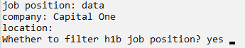

# JOB FILTER 
## 1. How to get API key
* The API key in the python code is: a463df1e2c78e577d9220ceeba3d0f6cc418db1a445ed7520d0fc6b0c62ab95a
* This API key will be invalid after 12/19/2020, if you want to use API key after that day, you could click the link to apply API key for free (15 days free trial): https://serpapi.com/
## 2. Python packages:
* (1) GoogleSearch--link: https://pypi.org/project/google-search-results/ (pip install google-search-results)
* (2) BeautifulSoup--link: https://pypi.org/project/beautifulsoup4/ (pip install beautifulsoup4)
* (3) requests--link:https://pypi.org/project/requests/ (pip install requests)
* (4) secrets--link:https://pypi.org/project/python-secrets/ (pip install python-secrets)
* (5) sqlite3
* (6) time
## 3. how to interact with the program：
* (1) Download all the files in the '507-FINAL-PROJECT'
* (2) Run the python file: combine-api-web.py
* (3）The program will ask you to input 4 commands. You are required to input the position that you want to apply for, and must input the correct value: yes / no in the last command, you can skip the second and third commands: "company" and "location" if you don't want to narrow the search. 
* (4) If you input the 'Yes' in the last command line ('Whether to filter h1b job position?'),the program will filter the results and only print the positions that could support sponsorship (H1B)
* (5) If you input the 'No' in the last command line ('Whether to filter h1b job position?'), the program won't filter the results and will print all the position results that you are searching for. 
* (6) Based on (5), after print all the position results, you still have the choose to view the H1B information, you could input the position id to view the details of this position's h1b status.
* (7) The detailed will be showed in the video, you can back to the previous pages and exit the program at any time.
